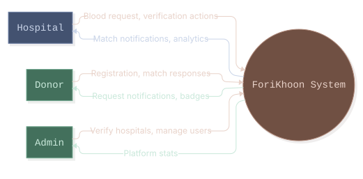
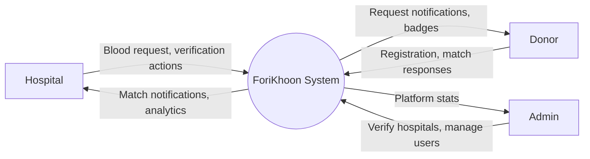
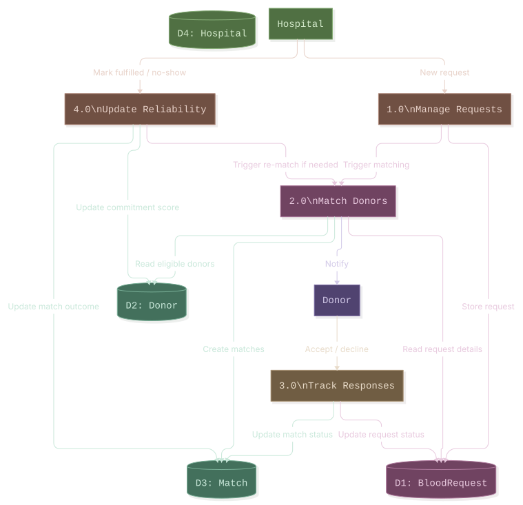
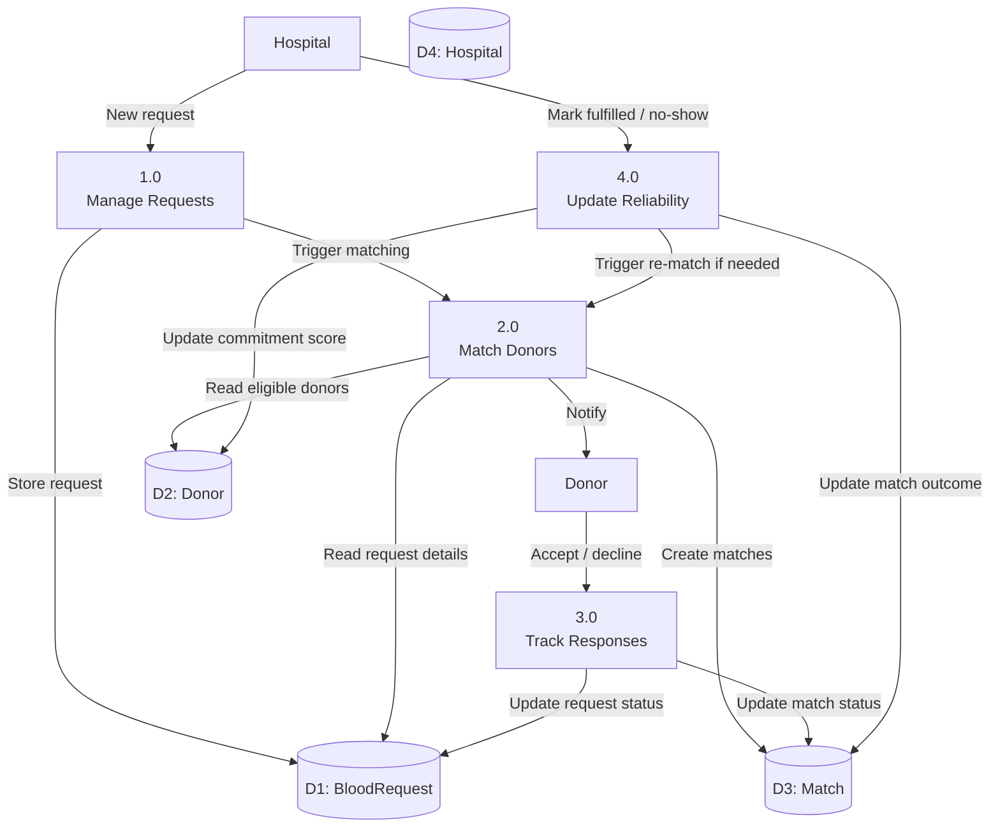

# Data Flow Diagrams

## Level 0 — Context Diagram

## Level 1 — Main Processes and Data Stores

## Notes

- The loop from **4.0 (Update Reliability) back into 2.0 (Match Donors)** is the escalation mechanism — a decline or no-show doesn't just update a record, it re-triggers the matching process to find a replacement donor. This is the part of the design that isn't a simple linear CRUD flow.
- Level 1 omits the AI-ranking sub-step and the 90-day eligibility / radius-tier filtering inside "2.0 Match Donors" for readability — see the sequence diagram for that level of detail.
