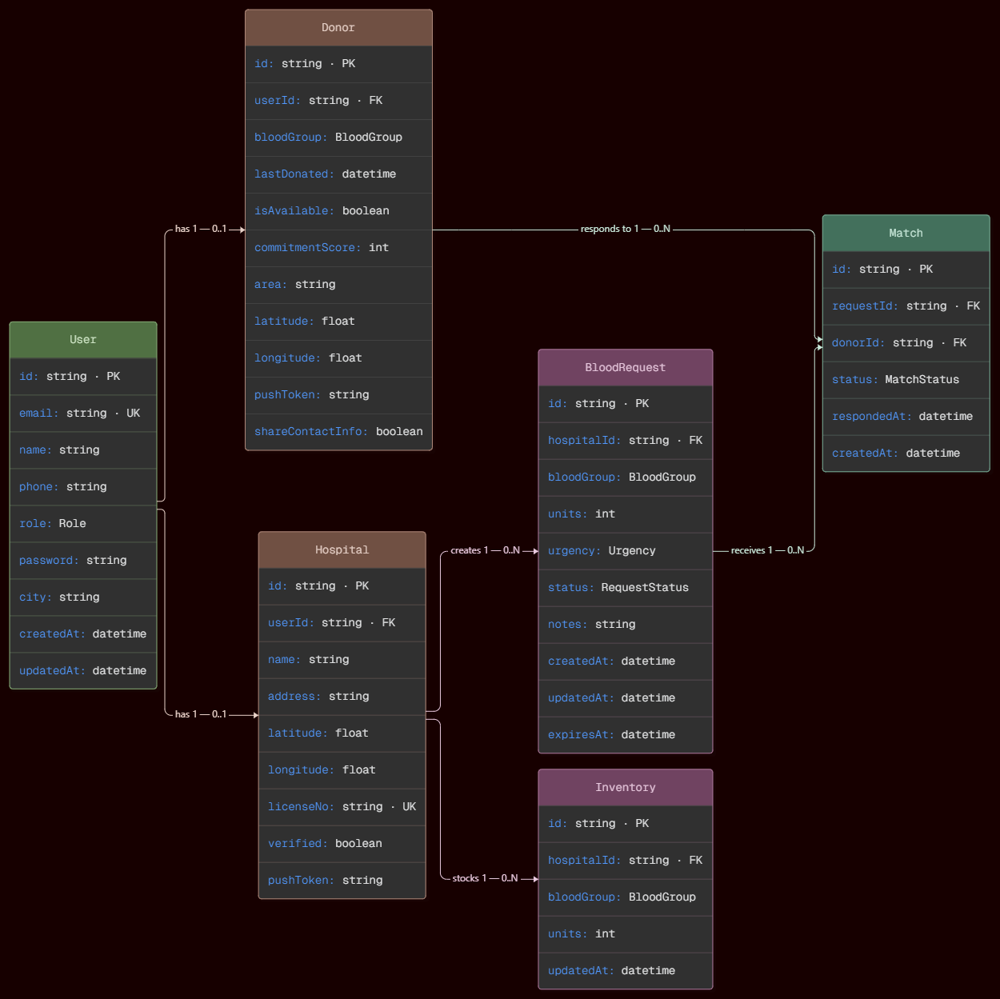
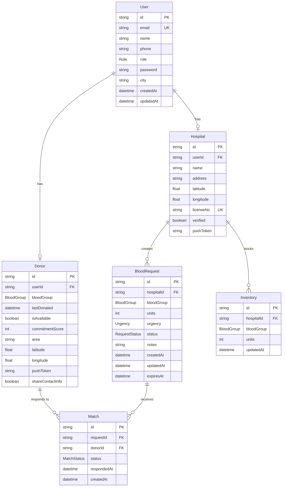

# Entity-Relationship Diagram

Database schema and relationships, based on `backend/prisma/schema.prisma`.

## Notes

- **`User` → `Donor`/`Hospital` is 1-to-0-or-1, not 1-to-1.** A `User` row can exist without a matching `Donor`/`Hospital` profile — this happens when registration's second step (profile creation) fails after the account itself is already created, and is a real edge case the system has to guard against.
- **`Inventory` has a composite unique constraint** on `(hospitalId, bloodGroup)` — enforces one row per blood group per hospital, which is what makes the inventory-update endpoint's `upsert` behave correctly.
- **`Match` is not a plain join table.** It carries meaningful state (`status`, `respondedAt`) that drives the entire escalation and commitment-score system — a donor-request pairing has a lifecycle, not just an association.
