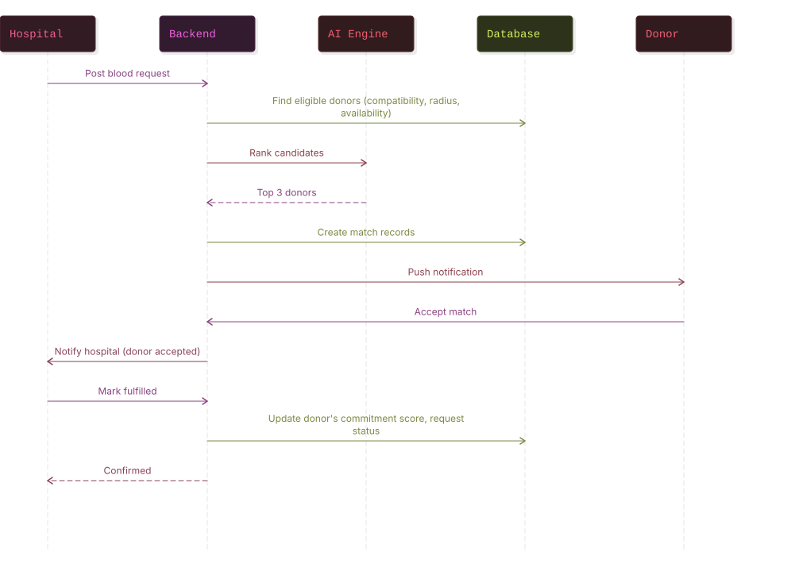
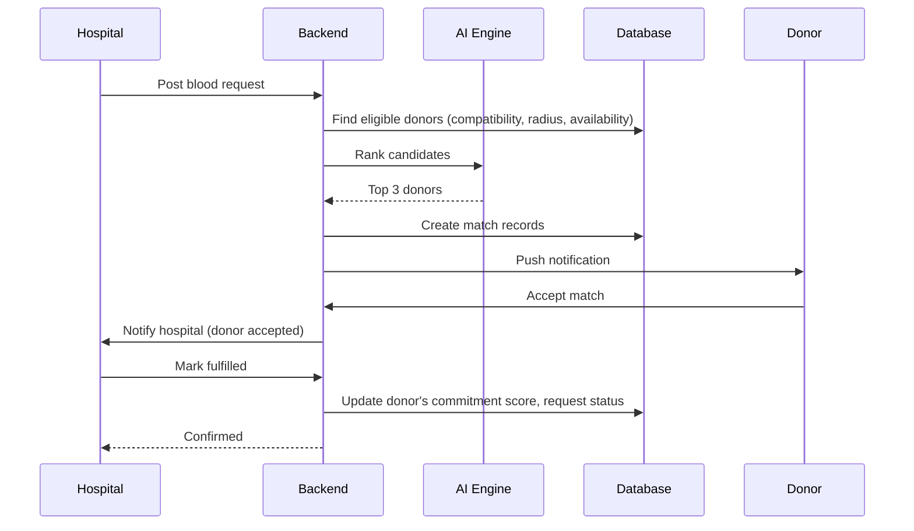
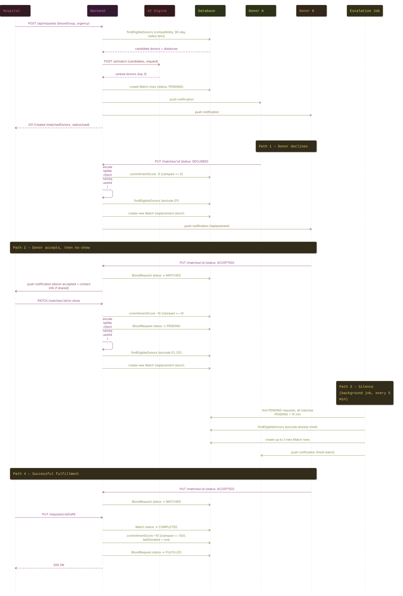
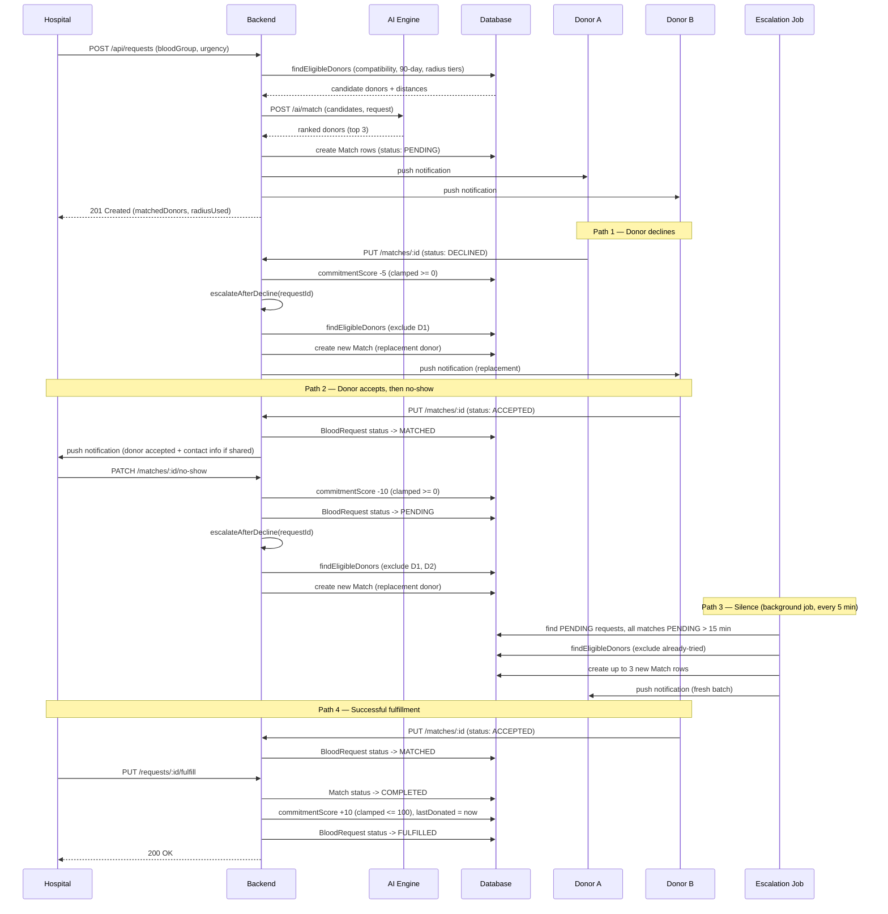

# Sequence Diagram

## Simplified — Happy Path

## Detailed — Full Lifecycle Including Escalation

## Notes

- Decline and no-show both call the same `escalateAfterDecline` function — they're the same underlying problem (request lost its donor, needs a replacement, exclude everyone already tried), just triggered from different events.
- All three escalation entry points (decline, no-show, silence-timeout) funnel through the same shared `findEligibleDonors` query, so the eligibility rules (compatibility, 90-day window, availability) can't drift out of sync between them.
- The `MATCHED → PENDING` transition on the no-show path exists because a no-show means the request no longer has a confirmed donor — it isn't resolved just because someone once accepted.
