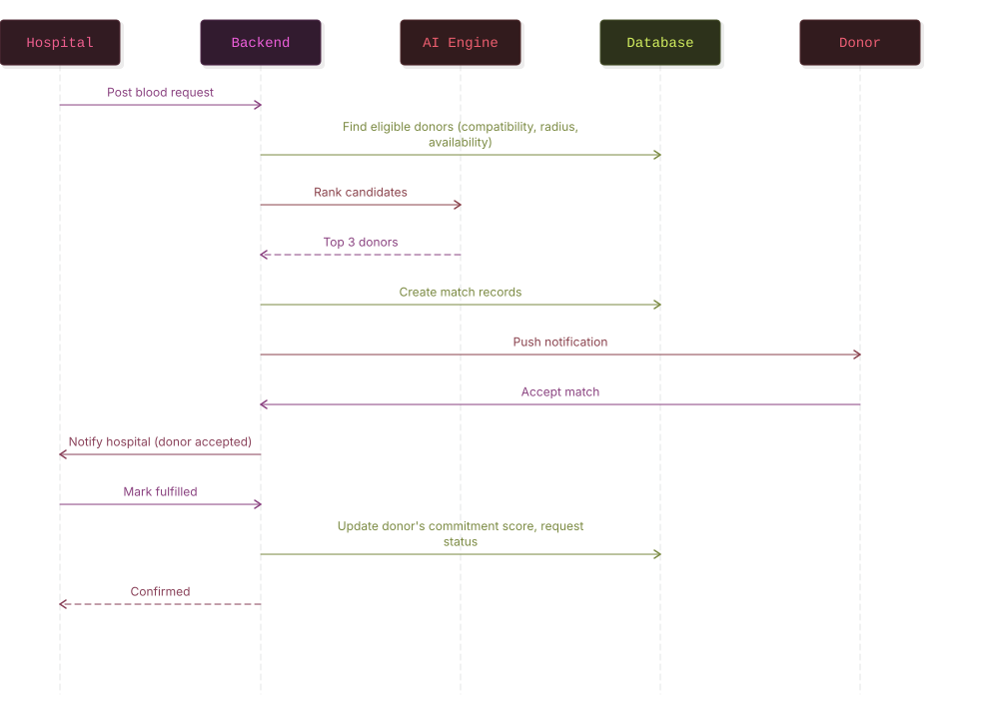
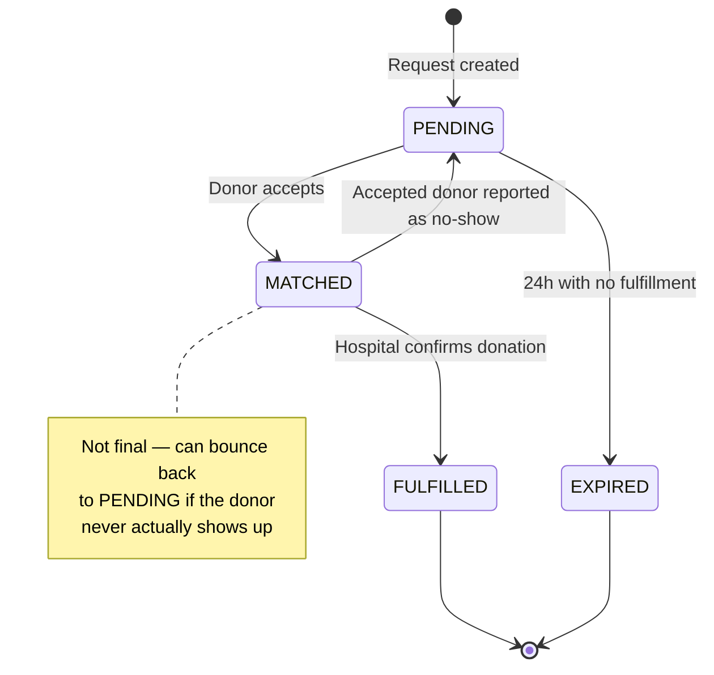
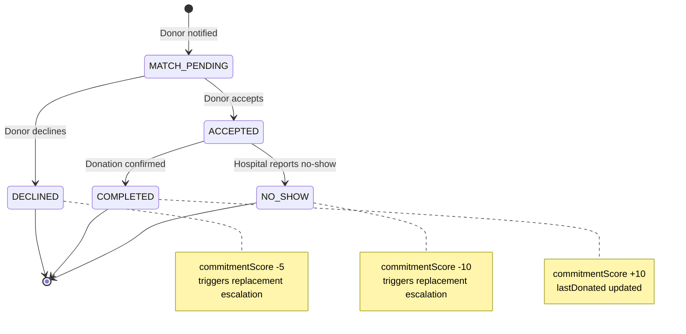

# State Diagrams

## BloodRequest Status

## Match Status

## Notes

- The `MATCHED → PENDING` transition on `BloodRequest` is the one transition that isn't a typical forward-only lifecycle step — it reflects that an accepted donor is not a guarantee, only a `COMPLETED` match resolves the request for good.
- `Match` status transitions are strictly one-directional and terminal (`DECLINED`, `COMPLETED`, `NO_SHOW` are all end states for that specific match) — a new attempt at fulfilling the request creates a **new** `Match` row rather than reusing or resetting an old one, which keeps a full audit trail of every donor who was ever tried for a given request.