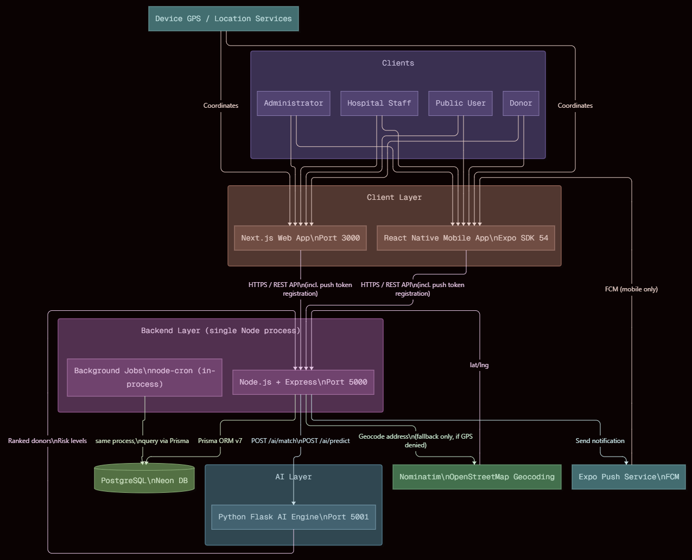
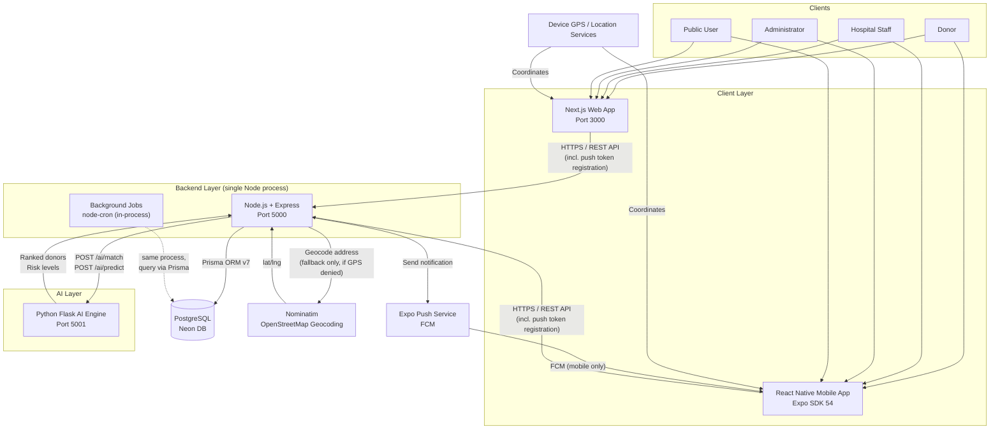

# System Architecture

High-level view of ForiKhoon's client, backend, AI, and external service layers.

## Notes

- **AI Layer is a separate process**, not a library call — the backend talks to it over HTTP (`localhost:5001`), which adds a network hop and a second point of failure in exchange for language/tooling separation (Python for scoring, room to move to a trained model later).
- **`jobs` runs in-process** with the backend (node-cron inside the same Express server), not as a separately deployed service — the dashed line reflects that it's the same process, just shown separately to highlight it as a distinct responsibility (expiry checks, escalation timeouts).
- **Nominatim is now a fallback path only.** Since GPS-based location capture became the primary registration method, geocoding only runs when a user denies location permission or explicitly chooses manual address entry.
- **Push notifications are mobile-only.** The web app has no browser-push implementation, so hospital/donor users on web rely on polling (dashboard refresh) rather than real-time push.
